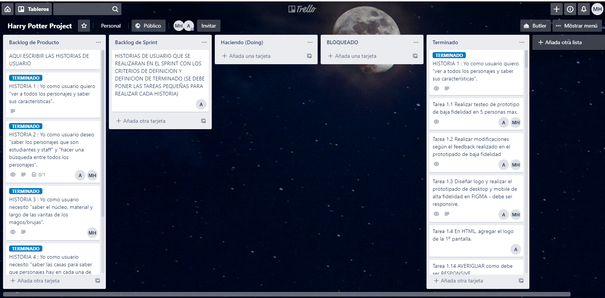
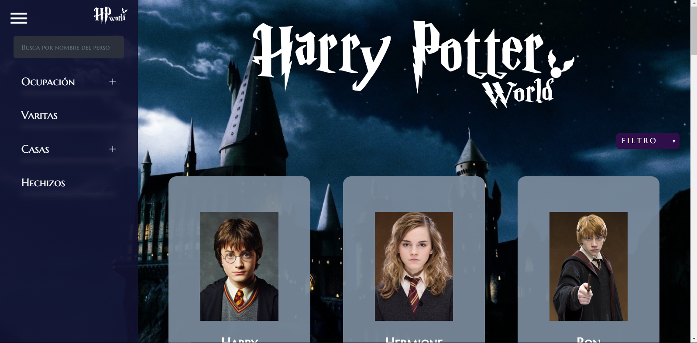
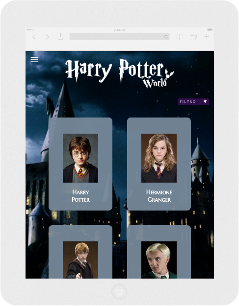
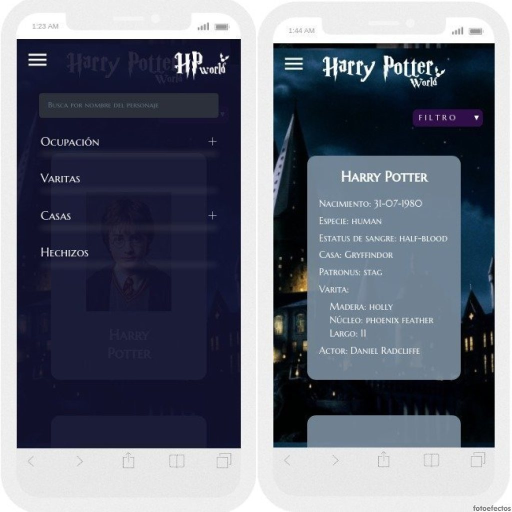

# Harry Potter World

## Índice

* [1. Descripción del proyecto](#1-descripción-del-proyecto)
* [2. Objetivos de aprendizaje](#2-objetivos-de-aprendizaje)
* [3. Definición de usuario](#3-definición-de-usuario)
* [4. Historias de usuario y planificación de proyecto](#4-historias-de-usuario-y-planificación-de-proyecto)
* [5. Diseño de Interfaz de Usuario](#5-diseño-de-interfaz-de-usuario)
* [6. Proyecto Final](#6-proyecto-final)
***

## 1. Descripción del proyecto

"Harry Potter World" es una web app que te ayudara a conocer todos los datos necesarios del mundo magico para que puedas jugar Harry Potter: Wizards Unite. En esta web app podras conocer datos importantes de tu personaje favorito, como: 

* Casa de Hogarwts a la que pertenece.
* Ocupacion en el mundo magico.
* Caracteristicas de su varita.
* Que tipo de Patronus tiene.

<!-- 
\* Puedes ver el detalle de la data en este [link](https://gist.github.com/lalogf/dd4aa3017a9f8aa8f90dfbca382c4dc9#file-student-json)
y la interfaz construida en este [link](https://app.talento.laboratoria.la/profile/HFOoMpOreBU2psCcjjLg5O2EWEv2).  -->

***

## 2. Objetivos de aprendizaje

### UX

- [X] Diseñar la aplicación pensando y entendiendo al usuario.
- [X] Crear prototipos para obtener _feedback_ e iterar.
- [X] Aplicar los principios de diseño visual (contraste, alineación, jerarquía).
- [ ] Planear y ejecutar _tests_ de usabilidad.

### HTML y CSS

- [ ] Entender y reconocer por qué es importante el HTML semántico.
- [ ] Identificar y entender tipos de selectores en CSS.
- [ ] Entender como funciona `flexbox` en CSS.
- [ ] Construir tu aplicación respetando el diseño planeado (maquetación).

### DOM

- [ ] Entender y reconocer los selectores del DOM (querySelector | querySelectorAll).
- [X] Manejar eventos del DOM. (addEventListener)
- [ ] Manipular dinámicamente el DOM. (createElement, appendchild, innerHTML, value)

### Javascript

- [ ] Manipular arrays (`filter` | `map` | `sort` | `reduce`).
- [ ] Manipular objects (key | value).
- [X] Entender el uso de condicionales (`if-else` | `switch`).
- [ ] Entender el uso de bucles (`for` | `forEach`).
- [ ] Entender la diferencia entre expression y statements.
- [ ] Utilizar funciones (parámetros | argumentos | valor de retorno).
- [ ] Entender la diferencia entre tipos de datos atómicos y estructurados.
- [ ] Utilizar ES Modules (`import` | `export`).

### Pruebas Unitarias (_testing_)
- [ ] Testear funciones (funciones puras).

### Git y GitHub
- [X] Ejecutar comandos de git (`add` | `commit` | `pull` | `status` | `push`).
- [X] Utilizar los repositorios de GitHub (`clone` | `fork` | gh-pages).
- [ ] Colaborar en Github (pull requests).

### Buenas prácticas de desarrollo
- [ ] Organizar y dividir el código en módulos (Modularización).
- [ ] Utilizar identificadores descriptivos (Nomenclatura | Semántica).
- [X] Utilizar linter para seguir buenas prácticas (ESLINT).

***

## 3. Definición de usuario

Harry Potter World esta dirigido a personas que deseen conocer mas sobre el mundo magico (primordialmente principantes) y que deseen aventurarse a jugar [Harry Potter: Wizards Unite](https://www.wizardingworld.com).

***

## 4. Historias de usuario y planificación de proyecto

* **HISTORIA 1 :** Yo como usuario quiero "ver a todos los personajes y saber sus características".

* **HISTORIA 2 :** Yo como usuario deseo "saber los personajes que son estudiantes y staff" y "hacer una búsqueda entre todos los personajes".

* **HISTORIA 3 :** Yo como usuario necesito "saber el núcleo, material y largo de las varitas de los magos/brujas".

* **HISTORIA 4 :** Yo como usuario necesito "saber las casas para saber que personajes hay en cada una de ellas".

* **HISTORIA 5 :** Yo como usuario necesito "saber el patronus de mi personaje favorito".

**Planificación de proyecto**

* La planificación de las tareas del proyecto puede ser vista en [Harry Potter Project](https://trello.com/b/48iz8Scv/harry-potter-project)

***
## 5. Diseño de Interfaz de Usuario

### Prototipo de baja fidelidad

Durante tu trabajo deberás haber hecho e iterado bocetos (_sketches_) de tu
solución usando papel y lápiz. Te recomendamos tomar fotos de todas las
iteraciones que hagas, que las subas a tu repositorio y las menciones en tu
`README.md`.

### Prototipo de alta fidelidad

Lo siguiente es diseñar tu Interfaz de Usuario (UI por sus siglas en inglés -
_User Interface_). Para eso debes aprender a utilizar alguna herramienta de
diseño visual. Nosotros te recomendamos [Figma](https://www.figma.com/) que es
una herramienta que funciona en el navegador y, además, puedes crear una cuenta
gratis. Sin embargo, eres libre de utilizar otros editores gráficos como
Illustrator, Photoshop, PowerPoint, Keynote, etc. Recuerda utilizar la
[identidad gráfica](https://drive.google.com/open?id=1eeWFqrWpy-OYOH4EHDckFGunyrm9iNeE)
correspondiente a cada set de datos que elijas.

El diseño debe representar el _ideal_ de tu solución. Digamos que es lo que
desearías implementar si tuvieras tiempo ilimitado para trabajar. Además, tu
diseño debe seguir los fundamentos de _visual design_.

#### Testeos de usabilidad

Durante el reto deberás hacer _tests_ de usabilidad con distintos usuarios, y
en base a los resultados, deberás iterar tus diseños. Cuéntanos
qué problemas de usabilidad detectaste a través de los _tests_ y cómo los
mejoraste en tu propuesta final.

### Implementación de la Interfaz de Usuario (HTML/CSS/JS)

Luego de diseñar tu interfaz de usuario deberás trabajar en su implementación.
**No** es necesario que construyas la interfaz exactamente como la diseñaste.
No tienes tiempo ilimitado para trabajar, así es que deberás priorizar.

Como mínimo, tu implementación debe:

1. Mostrar la data en una interfaz: puede ser un card, una tabla, una lista, etc.
2. Permitir al usuario interactuar para obtener la infomación que necesita. <!--filtrar y ordenar la data.-->
3. Ser _responsive_, es decir, debe visualizarse sin problemas desde distintos
   tamaños de pantallas: móviles, tablets y desktops.
4. Que la interfaz siga los fundamentos de _visual design_.

### Pruebas unitarias

El _boilerplate_ de este proyecto no incluye Pruebas Unitarias (_tests_), así es
que  tendrás que escribirlas tú para las funciones que tenga tu código. <!--encargadas de  _procesar_, _filtrar_ y _ordenar_ la data, así como _calcular_
estadísticas.-->

Tus _pruebas unitarias_ deben dar una cobertura del 70% de _statements_
(_sentencias_), _functions_ (_funciones_), _lines_ (_líneas_), y _branches_
(_ramas_) del archivo `src/data.js` que contenga tus funciones y está detallado
en la sección de [Consideraciones técnicas](#srcdatajs).
***
## 6. Proyecto Final

### Vista desktop

### Vista tablet

### Vista mobile 
