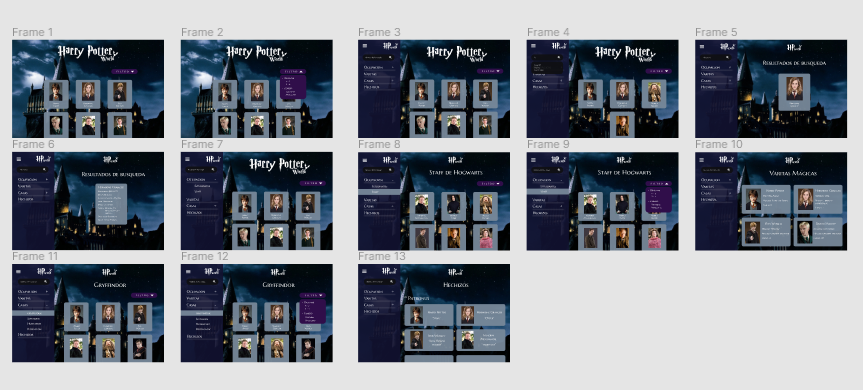

# Harry Potter World

## Índice

* [1. Descripción del proyecto](#1-descripción-del-proyecto)
* [2. Objetivos de aprendizaje](#2-objetivos-de-aprendizaje)
* [3. Definición de usuario](#3-definición-de-usuario)
* [4. Historias de usuario y planificación de proyecto](#4-historias-de-usuario-y-planificación-de-proyecto)
* [5. Diseño de Interfaz de Usuario](#5-diseño-de-interfaz-de-usuario)
* [6. Proyecto Final](#6-proyecto-final)
***

## 1. Descripción del proyecto

"Harry Potter World" es una web app que te ayudara a conocer todos los datos necesarios del mundo magico para que puedas jugar Harry Potter: Wizards Unite. En esta web app podras conocer datos importantes de tu personaje favorito, como:

* Casa de Hogarwts a la que pertenece.
* Ocupacion en el mundo magico.
* Caracteristicas de su varita.
* Que tipo de Patronus tiene.

***

## 2. Objetivos de aprendizaje

### UX

- [X] Diseñar la aplicación pensando y entendiendo al usuario.
- [X] Crear prototipos para obtener _feedback_ e iterar.
- [X] Aplicar los principios de diseño visual (contraste, alineación, jerarquía).
- [ ] Planear y ejecutar _tests_ de usabilidad.

### HTML y CSS

- [ ] Entender y reconocer por qué es importante el HTML semántico.
- [ ] Identificar y entender tipos de selectores en CSS.
- [ ] Entender como funciona `flexbox` en CSS.
- [ ] Construir tu aplicación respetando el diseño planeado (maquetación).

### DOM

- [ ] Entender y reconocer los selectores del DOM (querySelector | querySelectorAll).
- [X] Manejar eventos del DOM. (addEventListener)
- [ ] Manipular dinámicamente el DOM. (createElement, appendchild, innerHTML, value)

### Javascript

- [ ] Manipular arrays (`filter` | `map` | `sort` | `reduce`).
- [ ] Manipular objects (key | value).
- [X] Entender el uso de condicionales (`if-else` | `switch`).
- [ ] Entender el uso de bucles (`for` | `forEach`).
- [ ] Entender la diferencia entre expression y statements.
- [ ] Utilizar funciones (parámetros | argumentos | valor de retorno).
- [ ] Entender la diferencia entre tipos de datos atómicos y estructurados.
- [ ] Utilizar ES Modules (`import` | `export`).

### Pruebas Unitarias (_testing_)
- [ ] Testear funciones (funciones puras).

### Git y GitHub
- [X] Ejecutar comandos de git (`add` | `commit` | `pull` | `status` | `push`).
- [X] Utilizar los repositorios de GitHub (`clone` | `fork` | gh-pages).
- [ ] Colaborar en Github (pull requests).

### Buenas prácticas de desarrollo
- [ ] Organizar y dividir el código en módulos (Modularización).
- [ ] Utilizar identificadores descriptivos (Nomenclatura | Semántica).
- [X] Utilizar linter para seguir buenas prácticas (ESLINT).

***

## 3. Definición de usuario

Harry Potter World esta dirigido a personas que deseen conocer mas sobre el mundo magico (primordialmente principantes) y que deseen aventurarse a jugar [Harry Potter: Wizards Unite](https://www.wizardingworld.com).

***

## 4. Historias de usuario y planificación de proyecto

* **HISTORIA 1 :** Yo como usuario quiero "ver a todos los personajes y saber sus características".

* **HISTORIA 2 :** Yo como usuario deseo "saber los personajes que son estudiantes y staff" y "hacer una búsqueda entre todos los personajes".

* **HISTORIA 3 :** Yo como usuario necesito "saber el núcleo, material y largo de las varitas de los magos/brujas".

* **HISTORIA 4 :** Yo como usuario necesito "saber las casas para saber que personajes hay en cada una de ellas".

* **HISTORIA 5 :** Yo como usuario necesito "saber el patronus de mi personaje favorito".

**Planificación de proyecto**

* La planificación de las tareas del proyecto puede ser vista en [Harry Potter Project](https://trello.com/b/48iz8Scv/harry-potter-project)

***
## 5. Diseño de Interfaz de Usuario

### Prototipo de baja fidelidad

* Prototipo Baja Fidelidad Desktop

Para visualizar el prototipo detallado, dar click [aqui](http://bit.ly/prototipoDesktop)

* Prototipo Baja Fidelidad Mobile

Para visualizar el prototipo mobile detallado, dar click [aqui](http://bit.ly/prototipoMobile)

### Prototipo de alta fidelidad

* Prototipo Alta Fidelidad Desktop

Para visualizar el prototipo de alta fidelidad detallado, dar click [aqui](https://www.figma.com/file/VDEwkz4G4OFKzweit4jeAk/Harry-Potter-Project?node-id=0%3A1)

* Prototipo Alta Fidelidad Mobile

Para visualizar el prototipo de alta fidelidad mobile detallado, dar click [aqui](https://www.figma.com/proto/VDEwkz4G4OFKzweit4jeAk/Harry-Potter-Project?node-id=19%3A72&viewport=293%2C646%2C0.25&scaling=scale-down)

***
## 6. Proyecto Final

### Vista desktop

### Vista tablet

### Vista mobile

